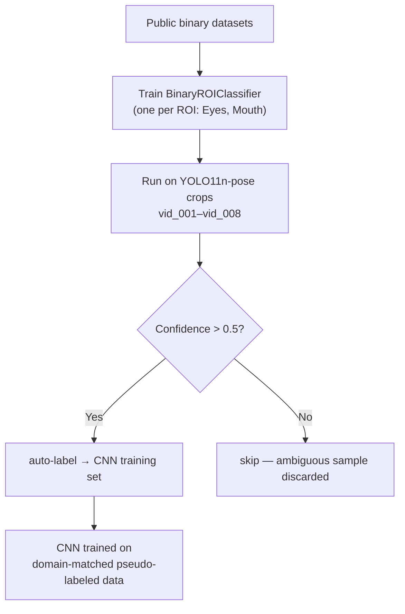
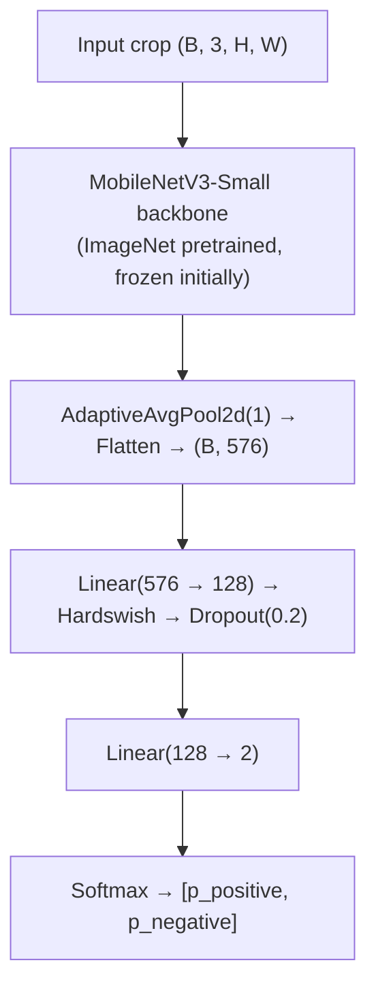
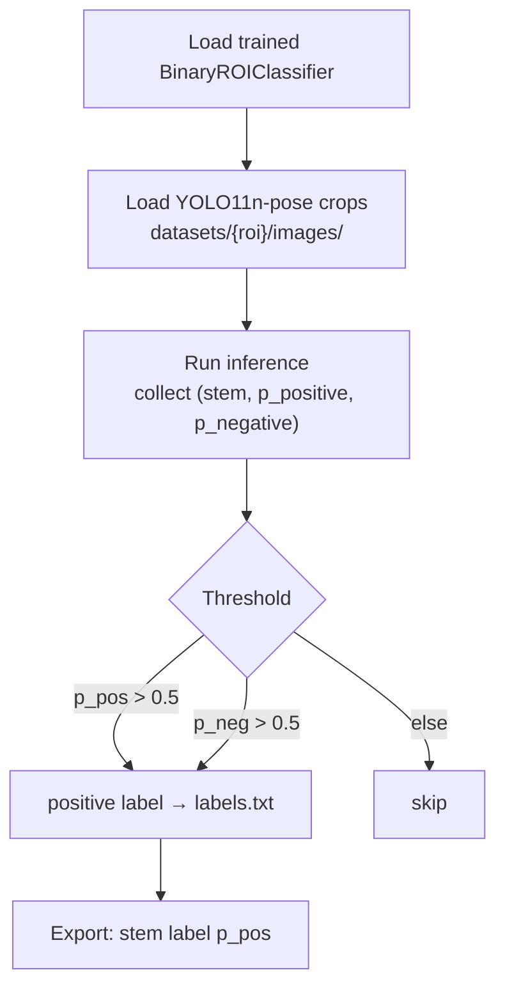

# Binary Classifier Bootstrap — Pseudo-Label Pipeline

## Problem

Eyes and Mouth CNNs (Phase B) require labeled crops. No public dataset matches FatigueSense domain directly. Manual annotation at scale is infeasible as a first step.

Head and Torso do **not** use CNN classifiers — their behavioral features are extracted from YOLO11n-pose keypoint geometry. No bootstrap pipeline is needed for those ROIs.

## Strategy

Train lightweight binary classifiers for Eyes and Mouth on existing public datasets. Run them on raw FatigueSense video crops to auto-generate pseudo-labels. Use high-confidence pseudo-labels to bootstrap CNN training data.



---

## Architecture — Shared Across Eyes + Mouth

Single `BinaryROIClassifier` class instantiated per ROI. Architecture identical regardless of ROI; input spatial size handled by `AdaptiveAvgPool2d`.



Binary labels per ROI:

| ROI   | Positive class (index 0) | Negative class (index 1) |
|-------|--------------------------|--------------------------|
| Eyes  | `eyes_closed`            | `eyes_open`              |
| Mouth | `mouth_open` (yawn)      | `mouth_closed`           |

---

## Confidence Threshold

Strict binary threshold — no intermediate class, no review queue for ambiguous samples.

```
p_pos = softmax output index 0

if p_pos > 0.5  → positive label (auto-label)
if p_neg > 0.5  → negative label (auto-label)
else            → skip (discarded)
```

Ambiguous samples (where neither class exceeds 0.5) are simply excluded from the pseudo-label set. This keeps the auto-labeled training data clean at the cost of coverage. Fine-grained intermediate states (partially closed eyes, slight mouth opening) are captured by the BiGRU temporal model, not per-frame classification.

---

## Training Data Per ROI

| ROI   | Dataset | Size | License | Task framing |
|-------|---------|------|---------|--------------|
| Eyes  | [MRL+CEW Composite](https://www.kaggle.com/datasets/prasadvpatil/mrl-dataset) | ~10,000 | CC0 | `Closed=0`, `Open=1` |
| Eyes  | [Eye Open/Close](https://www.kaggle.com/datasets/dhirdevansh/eye-dataset-openclose-for-drowsiness-prediction) | 4,000 | MIT | Supplement; pre-cropped 93×93px greyscale |
| Mouth | [4-class Drowsiness](https://www.kaggle.com/datasets/hoangtung719/drowsiness-dataset) | 11,566 | CC BY-NC-SA 4.0 | `yawn=0`, `no_yawn=1`; discard eye-class rows |
| Mouth | [Yawn Dataset](https://www.kaggle.com/datasets/davidvazquezcic/yawn-dataset) | ~5,119 | CC BY-NC-SA 4.0 | Supplement |

---

## Training Procedure

### Stage 1 — Frozen Backbone (Epochs 1–10)

- Backbone frozen; train head only
- LR: `1e-3`, Adam
- Batch size: 64
- Augmentation: Grayscale→3ch, random horizontal flip, ±15° rotation, ColorJitter(brightness=0.3, contrast=0.3)
- Loss: CrossEntropyLoss

### Stage 2 — Partial Unfreeze (Epochs 11–25)

- Unfreeze last 2 inverted residual blocks of backbone
- LR: `1e-4` (backbone), `1e-3` (head) — differential
- Add MixUp augmentation (α=0.4)
- Early stopping: patience=5, monitor val loss

### Validation

Hold out 15% as validation. Report per-class precision, recall, F1. Target: **F1 ≥ 0.90** before using classifier for pseudo-labeling.

---

## Pseudo-Labeling Pipeline

**Script:** `scripts/label_eyes.py` (Eyes); equivalent script for Mouth when ready.



Output format (space-separated, no header):
```
vid_001_frame_000130 eyes_closed 0.9312
vid_001_frame_000145 eyes_open 0.1204
```

**Quality gate:** Before merging pseudo-labels into CNN training data, draw a random sample of 200 crops and verify manually. Proceed only if manual precision ≥ 0.92.

---

## Bias Mitigation

- **Dual-model cross-check (Eyes):** Run two independent binary classifiers (one trained on MRL+CEW, one on Eye Open/Close) and only auto-label where both agree.
- **Confidence calibration:** Apply temperature scaling (T=1.5) to softmax before thresholding — raw softmax overconfidence is a known failure mode.
- **Diversity check:** Verify auto-labeled set covers all lighting conditions, subjects, and occlusion variants before committing to CNN training.

---

## File Structure

```
src/
└── models/
    └── binary_roi_classifier.py   # BinaryROIClassifier model

scripts/
└── label_eyes.py                  # Inference + threshold + txt export

datasets/
└── Eyes/
    ├── images/                    # Raw unlabeled crops
    └── eyes_labels.txt            # Pseudo-label output

runs/
└── binary/
    └── eyes/
        ├── best.pt                # Best checkpoint
        └── training_curves.png
```

---

## Success Criteria

| Milestone | Criteria |
|-----------|----------|
| Binary classifier trained | Val F1 ≥ 0.90 |
| Pseudo-labeling complete | ≥ 5,000 confident crops per ROI |
| Manual quality gate passed | Random sample precision ≥ 0.92 |
| CNN baseline | Val accuracy ≥ 0.80 per ROI head on pseudo-labeled data |
