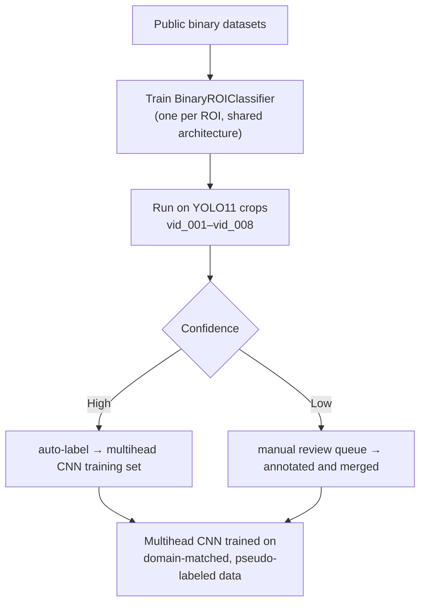
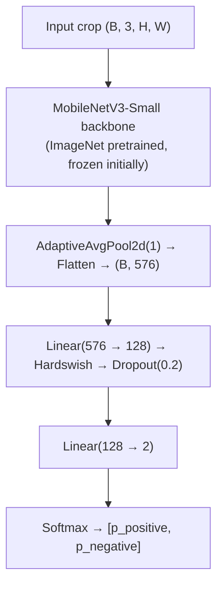
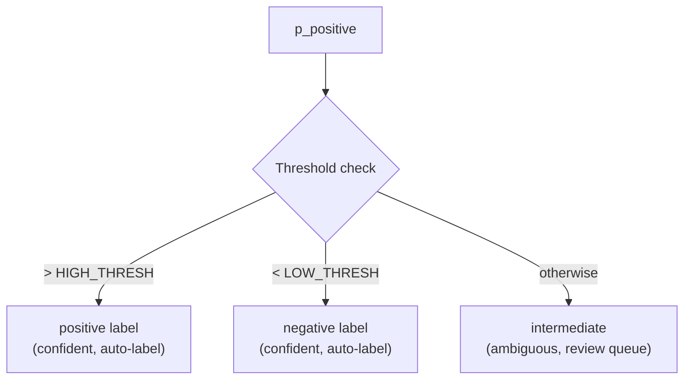
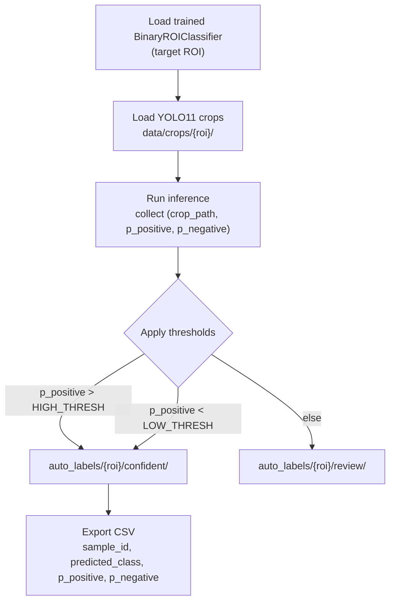

# Binary Classifier Bootstrap — Pseudo-Label Pipeline

## Problem

The multihead CNN (Phase B) requires labeled crops for all four ROIs across fine-grained multi-class schemes. No public dataset matches these classes directly. Manual annotation of raw video at scale is infeasible as a first step.

## Strategy

Train lightweight binary classifiers per ROI on existing public datasets. Run them on raw FatigueSense video crops to auto-generate pseudo-labels. Use high-confidence pseudo-labels to bootstrap the multihead CNN training dataset.



---

## Architecture — Shared Across All ROIs

Single `BinaryROIClassifier` class instantiated once per ROI. Architecture identical regardless of ROI; only input spatial size differs (handled by `AdaptiveAvgPool2d`).



Binary labels per ROI:

| ROI   | Positive class           | Negative class        |
|-------|--------------------------|-----------------------|
| Eyes  | `eyes_closed`            | `eyes_open`           |
| Mouth | `mouth_wide_open` (yawn) | `mouth_closed`        |
| Head  | `head_down`              | `head_neutral`        |
| Torso | `torso_heavy_slouch`     | `torso_upright`       |

---

## Soft Threshold — Intermediate States

`p_positive` (softmax index 0) drives three-way classification via confidence thresholds. Thresholds are configurable per ROI.



Default thresholds:

| ROI   | LOW_THRESH | HIGH_THRESH | Intermediate maps to          |
|-------|-----------|------------|-------------------------------|
| Eyes  | 0.15      | 0.85       | `eyes_partially_closed`       |
| Mouth | 0.15      | 0.85       | `mouth_slight_open`           |
| Head  | 0.20      | 0.80       | manual review                 |
| Torso | 0.20      | 0.80       | manual review                 |

Eyes and Mouth intermediate states can be auto-labeled (the intermediate class is semantically well-defined). Head and Torso intermediate crops go to manual review — ambiguous posture is harder to define from softmax confidence alone.

---

## Training Data Per ROI

| ROI   | Dataset                                                                                                 | Size    | License        | Task framing                                    |
|-------|---------------------------------------------------------------------------------------------------------|---------|----------------|-------------------------------------------------|
| Eyes  | [MRL+CEW Composite](https://www.kaggle.com/datasets/prasadvpatil/mrl-dataset)                          | ~10,000 | CC0            | `closed=1`, `open=0`                           |
| Eyes  | [Eye Open/Close](https://www.kaggle.com/datasets/dhirdevansh/eye-dataset-openclose-for-drowsiness-prediction) | 4,000   | MIT      | Supplement; pre-cropped 93×93px                |
| Mouth | [4-class Drowsiness](https://www.kaggle.com/datasets/hoangtung719/drowsiness-dataset)                  | 11,566  | CC BY-NC-SA 4.0| `yawn=1`, `no_yawn=0`; discard eye-class rows  |
| Mouth | [Yawn Dataset](https://www.kaggle.com/datasets/davidvazquezcic/yawn-dataset)                           | ~5,119  | CC BY-NC-SA 4.0| Supplement                                      |
| Head  | [DD-Pose](https://dd-pose-dataset.tudelft.nl/)                                                         | ~330k   | Academic       | pitch < −15° = positive; pitch > −10° = negative; discretize continuous labels |
| Head  | [BIWI Kinect Head Pose](https://huggingface.co/datasets/ETHZurich/biwi_kinect_head_pose)               | ~15k    | Academic       | Same bucketing strategy                         |
| Torso | [Sitting Posture (Roboflow)](https://universe.roboflow.com/project-design-20242025/sitting-posture-classification-6vwq1) | ~4,813 | Check project | Remap to upright/slouch binary |

### Head Pose Bucketing

DD-Pose and BIWI provide continuous pitch/yaw/roll angles. Convert to binary:

```
positive (head_down):  pitch  < -15°
negative (head_neutral): pitch > -10°  AND  |yaw| < 20°  AND  |roll| < 15°
discard: all other samples (ambiguous transition zone)
```

Discarding ambiguous samples keeps the binary training set clean. Ambiguous real-world crops are handled by the pseudo-label review queue, not by training data compromise.

---

## Training Procedure

### Stage 1 — Frozen Backbone (Epochs 1–10)

- Freeze entire backbone; train head only
- LR: `1e-3`, Adam
- Batch size: 64
- Augmentation: random horizontal flip, ±15° rotation, ColorJitter(brightness=0.3, contrast=0.3)
- Loss: CrossEntropyLoss

### Stage 2 — Full Fine-Tune (Epochs 11–25)

- Unfreeze backbone layers 10–16 (last two inverted residual blocks)
- LR: `1e-4` (backbone), `1e-3` (head) — differential learning rates
- Add MixUp augmentation (α=0.4)
- Early stopping: patience=5, monitor val loss

### Validation

Hold out 15% of each dataset as validation. Report per-class precision, recall, F1. Target: F1 ≥ 0.90 before using classifier for pseudo-labeling.

---

## Pseudo-Labeling Pipeline

**Script:** `scripts/pseudo_label.py`



Only confident crops enter the multihead CNN training set automatically. Review crops are staged for annotation via Label Studio or manual inspection.

**Quality gate:** Before merging pseudo-labels, draw a random sample of 200 confident crops per ROI and verify accuracy manually. Proceed only if manual precision ≥ 0.92.

---

## Bias Mitigation

Binary model errors compound into the multihead CNN if unchecked.

- Cross-check: for Eyes and Mouth, run two independent binary models (e.g., one trained on MRL, one on Eye Open/Close) and only auto-label crops where both agree.
- Confidence calibration: apply temperature scaling (T=1.5) to softmax outputs before thresholding — raw softmax overconfidence is a known failure mode.
- Diversity check: verify auto-labeled set covers all lighting conditions, subjects, and occlusion variants present in raw FatigueSense videos before committing to multihead training.

---

## Integration with Multihead CNN

Once pseudo-labeled crops are reviewed and merged:

1. Extend `configs/roi_config.yaml` — no changes needed (class labels already defined)
2. Organize crops into `data/crops/{roi}/{class_label}/` directory structure
3. Train multihead CNN with `freeze_backbone=True` (Stage 1), then unfreeze (Stage 2)
4. Binary classifiers are training tools only — they are not deployed in the live pipeline

---

## File Structure

```
src/
└── models/
    ├── binary_roi_classifier.py   # BinaryROIClassifier model + ThresholdPredictor
    └── multi_head_cnn.py          # Existing — unchanged during bootstrap

scripts/
└── pseudo_label.py                # Inference + threshold + CSV export

data/
└── crops/
    ├── eyes/
    │   ├── confident/             # Auto-labeled crops
    │   └── review/                # Manual review queue
    ├── mouth/
    ├── head/
    └── torso/

docs/
└── binary_classifier_bootstrap.md  # This file
```

---

## Success Criteria

| Milestone | Criteria |
|-----------|----------|
| Binary classifier trained | Val F1 ≥ 0.90 per ROI |
| Pseudo-labeling complete | ≥ 5,000 confident crops per ROI |
| Manual quality gate passed | Random sample precision ≥ 0.92 per ROI |
| Multihead CNN baseline | Val accuracy ≥ 0.80 per ROI head on pseudo-labeled data |
