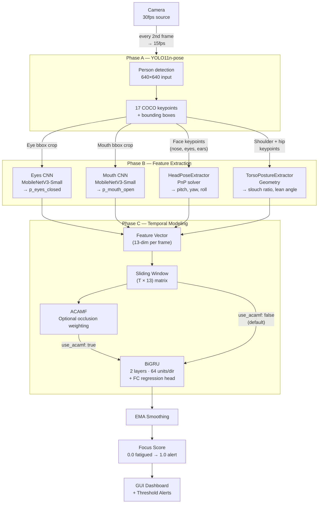
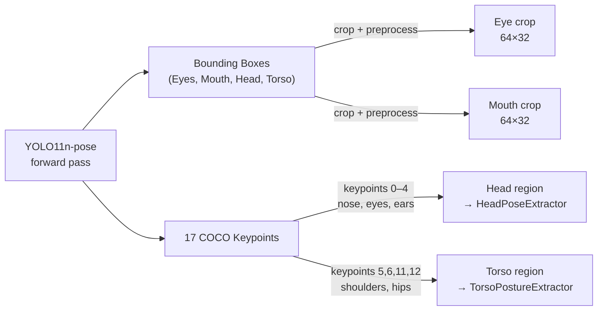
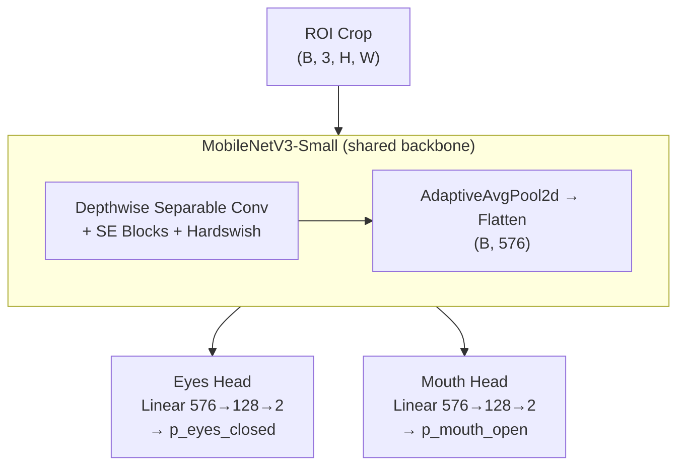
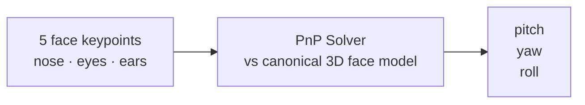
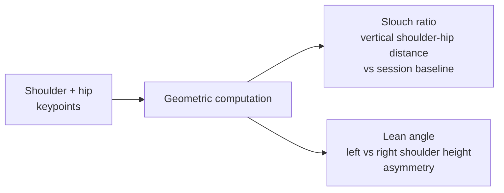
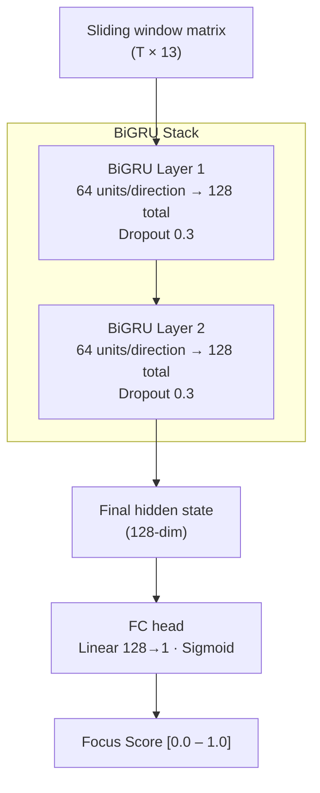
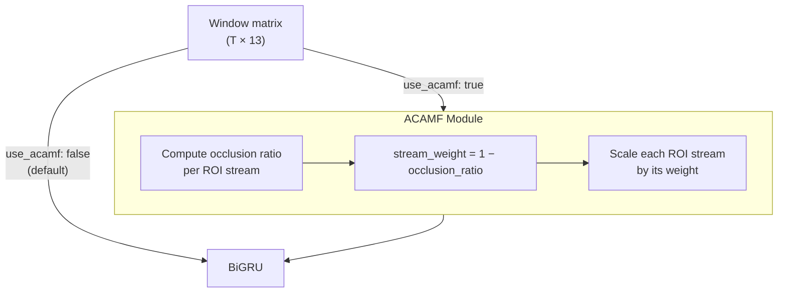
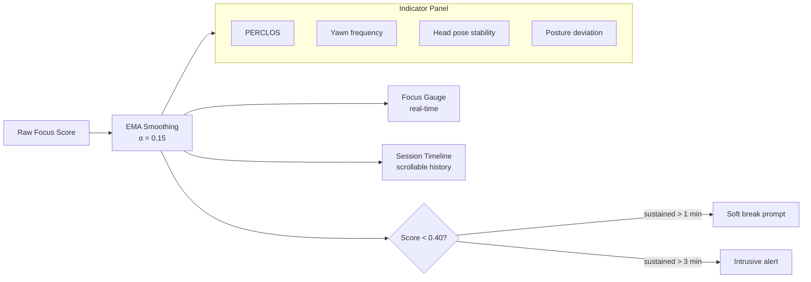
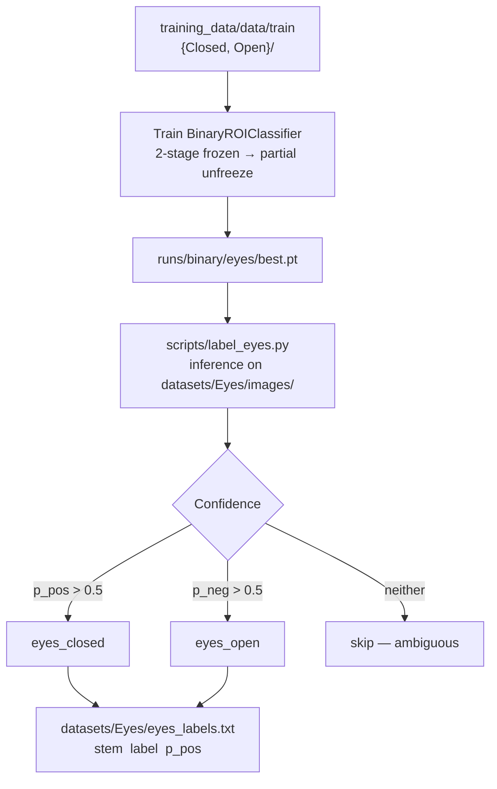

# FatigueSense — Implementation Plan

## Architecture Overview

3-phase pipeline:

1. **Phase A — Pose-Based Spatial Extraction:** YOLO11n-pose detects ROIs + extracts keypoints
2. **Phase B — CNN Classification:** MobileNetV3-Small classifies Eyes and Mouth crops (binary)
3. **Phase C — Temporal Modeling:** BiGRU across sliding windows → continuous Focus Score (0.0–1.0)

Target hardware: average laptop CPU. Target RTF < 1 (processing at 15fps via frame skipping).

### End-to-End Pipeline



---

## Phase A: YOLO11n-Pose — Spatial Localization

**Why pose model over detection-only:**
Head and torso behavioral states (pitch/yaw/roll, slouch ratio) are derivable from COCO keypoint geometry — no separate CNN needed for those ROIs. Single model pass provides both bounding boxes (for Eye/Mouth crops) and keypoints (for Head/Torso features).

### Configuration
- **Model:** YOLO11n-pose (nano variant, ~6MB)
- **Input Resolution:** 640×640
- **Confidence Threshold:** 0.5 — detections below discarded; missing ROI flagged as occluded
- **NMS IoU Threshold:** 0.45
- **Frame Rate:** 15fps (process every 2nd frame at 30fps source) → ~66ms/frame budget

### Outputs per Frame



### ROI Pre-Processing (Eyes/Mouth crops)
- Resize to fixed resolution per ROI: Eyes → 64×32, Mouth → 64×32
- Grayscale → 3-channel (`Grayscale(num_output_channels=3)`)
- Normalize with ImageNet mean/std `(0.485, 0.456, 0.406)` / `(0.229, 0.224, 0.225)`
- Padding applied when bounding box clips frame boundary

---

## Phase B: Feature Extraction

### Eyes + Mouth — CNN (MobileNetV3-Small)

Selected for: depthwise separable convolutions, strong mobile track record, pretrained ImageNet weights.



**Training strategy:**
- Stage 1 (epochs 1–10): frozen backbone, head only, LR=1e-3
- Stage 2 (epochs 11–25): unfreeze last 2 backbone blocks, differential LR (backbone=1e-4, head=1e-3), MixUp(α=0.4)
- Early stopping: patience=5 on val loss

**Binary classification per ROI:**

| ROI | Positive (0) | Negative (1) | Decision |
|-----|-------------|-------------|---------|
| Eyes | `eyes_closed` | `eyes_open` | `p_pos > 0.5` |
| Mouth | `mouth_open` | `mouth_closed` | `p_pos > 0.5` |

**Why binary:** Fine-grained states (partially closed, talking vs yawning) are captured by temporal patterns downstream. Binary keeps noise ceiling manageable and training data requirements low.

---

### Head — HeadPoseExtractor (keypoint geometry)

No CNN. Behavioral features derived geometrically from YOLO11n-pose face keypoints.



| Feature | Fatigue signal |
|---------|---------------|
| Pitch | Head drooping forward (pitch < −15°) |
| Yaw | Looking away from screen |
| Roll | Lateral head tilt — postural instability |

---

### Torso — TorsoPostureExtractor (keypoint geometry)

No CNN. Derived from shoulder and hip keypoints.



---

## Phase C: Temporal Modeling

Frame-level feature vectors organized into sliding windows for behavioral pattern detection.

### Feature Vector per Frame (13-dim)

```
┌─────────────┬─────────────┬─────────────────────────────┬──────────────────────────────┐
│  p_eyes_    │  p_mouth_   │   head_pitch  head_yaw       │  conf_eyes  conf_mouth        │
│  closed     │  open       │   head_roll   slouch_ratio   │  conf_head  conf_torso        │
│  (1 dim)    │  (1 dim)    │   lean_angle  (5 dims)       │  (4 dims)                     │
└─────────────┴─────────────┴─────────────────────────────┴──────────────────────────────┘
      CNN features (2)            Keypoint geometry (5)            YOLO confidence (4)
                                    total: 13 dims
```

Zero-padded for any occluded/missing ROI slot.

### Windowing Strategy

```mermaid
gantt
    title Sliding Window Scales (example at 15fps)
    dateFormat  x
    axisFormat %Ls

    section Short window
    Window 1     :0, 1000
    Window 2     :500, 1500
    Window 3     :1000, 2000

    section Moderate window
    Window A     :0, 3000
    Window B     :1500, 4500
```



| Window Scale | Duration | Frames @ 15fps | Target Events |
|---|---|---|---|
| Short | 250ms–1,000ms | 4–15 frames | Blinks, microsleeps, sudden head drops |
| Moderate | 2,000ms–5,000ms | 30–75 frames | PERCLOS, yawn frequency, postural slump |

- **Overlap:** 30–50% between successive windows
- **PERCLOS:** % frames with `p_eyes_closed > 0.5` in window — primary fatigue indicator

### Temporal Model: BiGRU

**Why BiGRU over BiLSTM:** Comparable accuracy on short sequences, ~30% fewer parameters, faster inference. GRU fuses forget/input gates into single update gate — fewer ops per step.



| Component | Detail |
|-----------|--------|
| Layers | 2 stacked BiGRU |
| Hidden size | 64 per direction (128 total) |
| Dropout | 0.3 between layers |
| Loss | MSE (regression on Focus Score) |
| Optimizer | Adam, LR=1e-3, ReduceLROnPlateau |
| Augmentation | ±1–2 frame temporal jitter |

### ACAMF — Optional Occlusion Module

By default, features feed directly into the BiGRU. The BiGRU's gating implicitly learns to suppress noisy/zero-padded inputs given sufficient training examples with occlusion.



Enable when:
- Occlusion is frequent in deployment but underrepresented in training data
- BiGRU shows degraded Focus Score stability during occluded frames

**Default:** disabled. Toggle via `use_acamf: true` in config.

---

## Phase D: Output and GUI



### Performance Targets

| Metric | Target |
|---|---|
| Processing rate | 15fps (every 2nd frame) |
| RTF | < 1 (CPU viable) |
| YOLO11n-pose latency | ~20–30ms/frame CPU |
| CNN latency (Eyes + Mouth) | ~5–10ms combined |
| BiGRU latency | < 5ms |
| Total deployed footprint | ≤ 20MB |

---

## Labeling Pipeline (Eyes)



---

> **Design Principle:** Binary frame-level classification + temporal pattern detection separates concerns cleanly. The CNN answers "what is visible now" — the BiGRU answers "what behavioral pattern is emerging over time."
