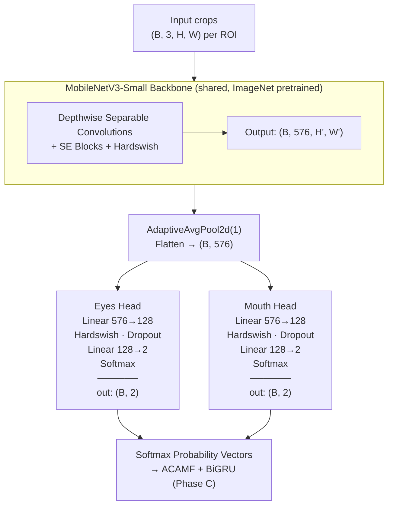
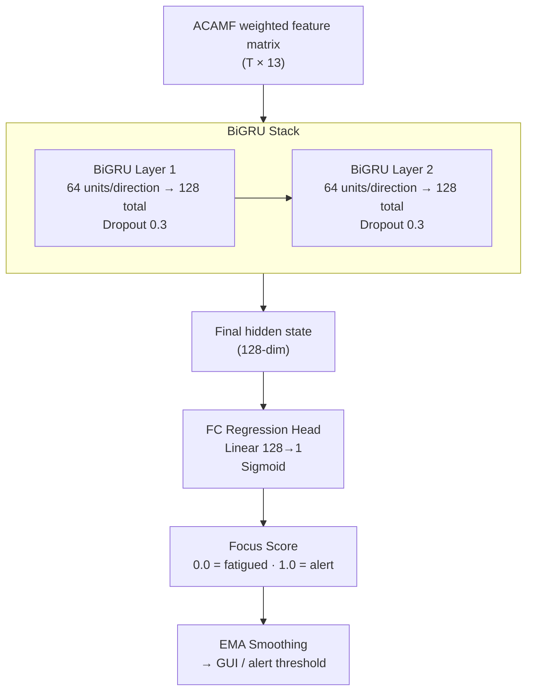

# Phase B — CNN Classification (Eyes + Mouth)

## Overview

Phase B classifies behavioral states from Eye and Mouth ROI crops produced by Phase A (YOLO11n-pose). **Head and Torso do not use CNN classification** — their behavioral features are derived from YOLO11n-pose keypoint geometry in Phase A.

A **shared MobileNetV3-Small backbone** processes Eye and Mouth crops. Two independent binary classification heads produce per-ROI softmax vectors consumed by Phase C (ACAMF + BiGRU).

---

## Why MobileNetV3-Small

| Criterion | Decision |
|-----------|----------|
| **Parameter count** | ~2.5M (full); heads-only fine-tune targets ~0.42M trainable params |
| **Inference latency** | ~3–5ms/frame CPU (single crop); fits within 15fps budget |
| **Pretrained weights** | ImageNet-1K via `torchvision` — strong low-level feature priors |
| **Depthwise separable convolutions** | Low FLOPs vs. standard conv |
| **SE blocks** | Built-in channel recalibration for fine-grained state discrimination |
| **Hardswish activation** | Cheaper than GELU/Swish; native to MobileNetV3 |

- **vs. GhostNet:** Weaker pretrained ecosystem for face/body crops.
- **vs. EfficientNet-Lite:** Higher latency for marginal accuracy gain on small crops.
- **vs. ShuffleNetV2:** Lower accuracy ceiling below 1M parameters.

---

## Architecture



### ROI Input Sizes

| ROI   | Input (H × W) | Classes | Labels |
|-------|---------------|---------|--------|
| Eyes  | 32 × 64       | 2 | `eyes_closed` (0), `eyes_open` (1) |
| Mouth | 32 × 64       | 2 | `mouth_open` (0), `mouth_closed` (1) |

### Pre-Processing (both ROIs)

1. Grayscale → 3-channel (`Grayscale(num_output_channels=3)`)
2. Resize to target H × W
3. Normalize: ImageNet mean `(0.485, 0.456, 0.406)` / std `(0.229, 0.224, 0.225)`

Grayscale applied at training and inference to match domain (eye/mouth crops are inherently low-color-information).

---

## Head + Torso — Keypoint Geometry Extractors

Head and Torso behavioral features come from YOLO11n-pose keypoints, not CNNs.

### HeadPoseExtractor
- **Input:** 5 face keypoints (nose, left/right eye, left/right ear)
- **Method:** Perspective-n-Point (PnP) solver against canonical 3D face model
- **Output features:** pitch, yaw, roll (degrees)

### TorsoPostureExtractor
- **Input:** Shoulder + hip keypoints
- **Output features:** slouch ratio (vertical shoulder-hip distance vs. baseline), lean angle (left/right shoulder height asymmetry)

---

## Design Decisions

### Binary Classification
Eyes and Mouth are strictly binary — no partially-closed or slight-open intermediate class. Fine-grained temporal states (blink duration, yawn frequency, PERCLOS) are captured by the BiGRU temporal model, not single-frame CNN classification.

### Shared Backbone
Single backbone for both CNN ROIs (Eyes + Mouth). Keeps parameter count low, allows both crops to batch in one forward pass.

### Backbone Freezing Strategy
- Stage 1 (epochs 1–10): backbone frozen, head only, LR=1e-3
- Stage 2 (epochs 11–25): last 2 backbone blocks unfrozen, differential LR (backbone=1e-4, head=1e-3), MixUp(α=0.4)
- Early stopping: patience=5 on val loss

### Occlusion Passthrough
If YOLO11n-pose fails to detect an ROI (confidence < 0.5), CNN is skipped. A zero vector is passed downstream; ACAMF assigns zero weight to that stream.

---

## Phase C — ACAMF + BiGRU Temporal Model

### Overview

Phase C consumes per-frame feature vectors from Phase B (CNN softmax) and Phase A (keypoint geometry), then outputs a continuous **Focus Score** in `[0.0, 1.0]`.

---

### Per-Frame Feature Vector

```
frame_vec = [p_eyes_closed | p_mouth_open | head_pitch | head_yaw | head_roll | slouch_ratio | lean_angle | eyes_conf | mouth_conf | head_conf | torso_conf]
             ─── 2 dims ──   ─── 2 dims ──  ────────────── 5 geometric dims ──────────────   ────────── 4 conf dims ──────────
             total: 13-dim vector per frame
```

If a CNN ROI is occluded, its prob slots are zeroed and confidence set to 0.0. If pose keypoints are absent, geometric dims are zeroed.

---

### ACAMF — Adaptive Confidence-Aware Multimodal Fusion

For each window of `T` frames:

```
occlusion_ratio[roi] = frames_where_conf < 0.5 / T
stream_weight[roi]   = 1 - occlusion_ratio[roi]
```

Each ROI's contribution is scaled by its `stream_weight` before BiGRU ingestion. Streams absent for the entire window contribute zero without corrupting the sequence.

---

### Temporal Windowing

| Parameter | Value |
|-----------|-------|
| Short window | 250ms – 1,000ms (~4–15 frames @ 15fps) |
| Moderate window | 2,000ms – 5,000ms (~30–75 frames @ 15fps) |
| Window overlap | 30–50% |
| Matrix shape | `(T, 13)` |

Short windows: microsleeps, sudden head drops. Moderate windows: PERCLOS, yawn frequency, postural slump trends.

**PERCLOS** = % frames in window where `p_eyes_closed > 0.5` — primary fatigue indicator.

---

### BiGRU Architecture

**Why BiGRU over BiLSTM:** Comparable accuracy on short sequences (15–75 frames), ~30% fewer parameters, faster inference. GRU fuses forget/input gates → fewer ops per step.



| Component | Detail |
|-----------|--------|
| Layers | 2 stacked BiGRU |
| Hidden size | 64 per direction (128 total per layer) |
| Dropout | 0.3 between layers |
| Output | Scalar regression via FC + Sigmoid |
| Loss | MSE against annotated Focus Score labels |
| Optimizer | Adam, lr=1e-3, ReduceLROnPlateau decay |
| Augmentation | ±1–2 frame temporal jitter during training |

**Why regression over classification:** Continuous Focus Score gives fine-grained threshold control. Binary fatigue/alert discards gradient signal across the early-onset spectrum where intervention is most valuable.

---

## File Reference

| File | Purpose |
|------|---------|
| `src/models/binary_roi_classifier.py` | `BinaryROIClassifier` — MobileNetV3-Small + 2-class head |
| `src/train_binary_classifier.py` | 2-stage training (frozen → partial unfreeze + MixUp) |
| `src/dataset/eyes_dataset.py` | EyesDataset + build_dataloaders |
| `scripts/label_eyes.py` | Pseudo-label raw crops using trained classifier |
