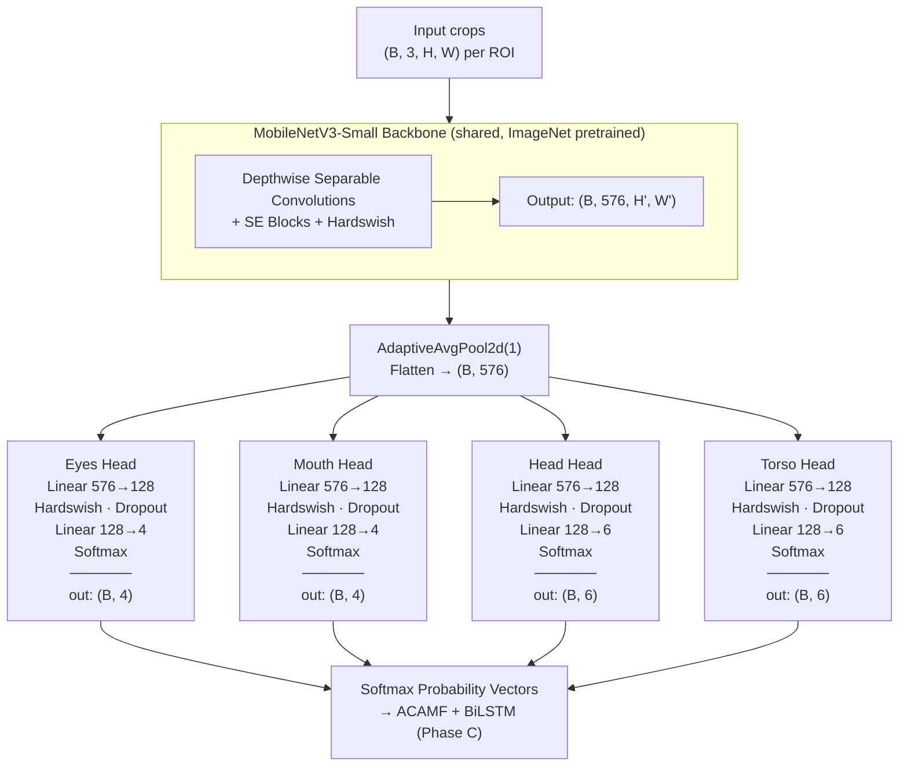
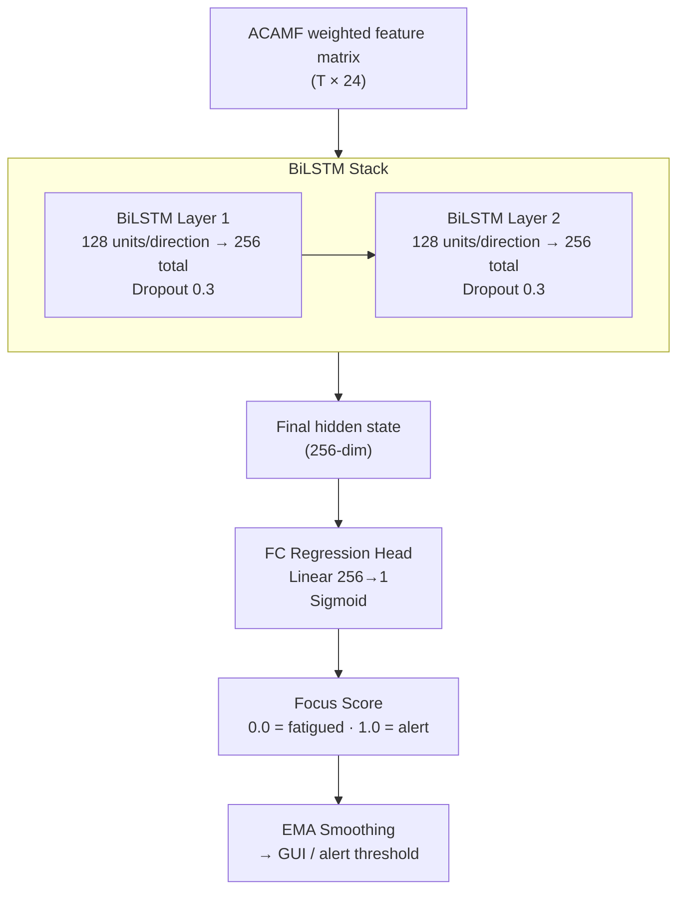

# Phase B — Multi-Head CNN Architecture

## Overview

Phase B classifies behavioral states from the four ROI crops produced by Phase A (YOLO11). A **shared MobileNetV3-Small backbone** processes all crops through the same feature extractor; four independent classification heads then produce per-ROI softmax probability vectors consumed by Phase C (ACAMF + BiLSTM).

---

## Why MobileNetV3-Small

| Criterion | Decision |
|-----------|----------|
| **Parameter count** | ~2.5M (full); heads-only fine-tune targets ~0.42M trainable params |
| **Inference latency** | ~3–5ms/frame CPU (single crop); well within 31–35ms end-to-end budget |
| **Pretrained weights** | ImageNet-1K available via `torchvision` — strong low-level feature priors for face/body crops |
| **Depthwise separable convolutions** | Drastically reduces FLOPs vs. standard conv while preserving spatial feature quality |
| **SE blocks (Squeeze-and-Excitation)** | Built-in channel recalibration — beneficial for fine-grained state discrimination (e.g., eyes partially closed vs. closed) |
| **Hardswish activation** | Computationally cheaper than GELU/Swish; native to MobileNetV3 |

MobileNetV3-Small was chosen over the alternatives for the following reasons:

- **vs. GhostNet:** Weaker pretrained ecosystem; fewer community-validated weights for transfer learning on face/body crops.
- **vs. EfficientNet-Lite:** Higher latency and parameter count for marginal accuracy gains on small, constrained crops (32×64 eyes, 64×64 mouth).
- **vs. ShuffleNetV2:** Lower accuracy ceiling on fine-grained per-frame classification; accuracy degrades significantly below 1M parameters.

---

## Architecture



### ROI Input Sizes

| ROI   | Input (H × W) | Output Classes | Class Labels |
|-------|---------------|----------------|--------------|
| Eyes  | 32 × 64       | 4 | `eyes_open`, `eyes_partially_closed`, `eyes_closed`, `eyes_occluded` |
| Mouth | 64 × 64       | 4 | `mouth_closed`, `mouth_slight_open`, `mouth_wide_open`, `mouth_occluded` |
| Head  | 128 × 128     | 6 | `head_neutral`, `head_down`, `head_up`, `head_left`, `head_right`, `head_occluded` |
| Torso | 128 × 128     | 6 | `torso_upright`, `torso_slight_slouch`, `torso_heavy_slouch`, `torso_lean_left`, `torso_lean_right`, `torso_occluded` |

---

## Design Decisions

### Shared Backbone

All four ROI crops are processed by the same MobileNetV3-Small backbone. This was chosen over per-ROI specialized backbones because:

- Keeps total parameter count well below the 0.42M trainable target when backbone is frozen.
- ImageNet features (edges, textures, shapes) transfer universally across all four crop types.
- Inference can batch all four crops in a single forward pass, minimizing wall-clock latency.

The per-ROI specialization is handled entirely at the head level (four independent MLP heads), which is sufficient given the structural simplicity of each classification task.

### Backbone Freezing Strategy

During initial training, the backbone is frozen (`freeze_backbone=True`). Only the four classification heads are trained. This:

- Reduces the effective trainable parameter count to ~4 × (576×128 + 128 + 128×N) ≈ 0.30–0.35M.
- Prevents overfitting on small per-ROI datasets before sufficient labeled data exists.
- Speeds up early training iterations significantly.

Full fine-tuning (unfreezing the backbone) is deferred to a second training stage once head convergence is established.

### Occlusion Passthrough

If YOLO11 fails to detect an ROI (confidence < 0.5), the CNN step is skipped for that slot entirely. A `None` value is returned in its output position. Downstream ACAMF interprets `None` as a fully occluded stream and assigns it zero weight in the fusion step. This avoids propagating garbage activations from a zero-padded crop.

### Serialization

Checkpoints are saved and loaded via `safetensors` (not `torch.save`/`pickle`). This eliminates the arbitrary code execution risk associated with pickle-based deserialization (CWE-502). Use `.safetensors` as the file extension.

---

## Knowledge Distillation (Planned)

Once the MobileNetV3-Small model reaches convergence, a Knowledge Distillation pass will compress it further toward the ~0.42M parameter target:

- **Teacher:** ResNet-50 or EfficientNet-B3, trained to convergence on the same ROI dataset.
- **Student:** MobileNetV3-Small (current architecture).
- **Loss:** Combined Cross-Entropy (hard labels) + KL Divergence (softened teacher logits, temperature T=4).
- **Target:** Student matches teacher accuracy within 1–2% at 10× fewer parameters.

---

## Phase C — ACAMF + BiLSTM Temporal Model

### Overview

Phase C consumes the per-frame softmax vectors from Phase B and outputs a continuous **Focus Score** in `[0.0, 1.0]`. Two components run in sequence: ACAMF fuses the four ROI streams into a single weighted feature vector; the BiLSTM reasons across time to produce the final scalar.

---

### ACAMF — Adaptive Confidence-Aware Multimodal Fusion

ACAMF down-weights ROI streams that are unreliable in a given window before they enter the BiLSTM. Reliability is derived from YOLO11 detection confidence, not from the CNN output itself.

**Per-frame feature vector construction:**

Each frame produces a concatenated vector of softmax probs + YOLO confidence scores:

```
frame_vec = [eyes_probs(4) | mouth_probs(4) | head_probs(6) | torso_probs(6) | eyes_conf | mouth_conf | head_conf | torso_conf]
            ──────────────────────────── 20 dims ─────────────────────────── ──────────── 4 dims ────────────
            total: 24-dim vector per frame
```

If an ROI is occluded (Phase B returns `None`), its prob slots are filled with zeros and its confidence score is set to 0.0.

**Occlusion ratio weighting:**

For each window of `T` frames, per-ROI occlusion ratio is computed:

```
occlusion_ratio[roi] = frames_where_conf < 0.5 / T
stream_weight[roi]   = 1 - occlusion_ratio[roi]
```

Each ROI's contribution is scaled by its `stream_weight` before the BiLSTM receives it. Streams absent for the entire window contribute zero signal without corrupting the sequence.

---

### Temporal Windowing

Frames are organized into overlapping 2D matrices before BiLSTM ingestion.

| Parameter | Value |
|-----------|-------|
| Short window | 250ms – 1,000ms (7–30 frames @ 30 FPS) |
| Moderate window | 2,000ms – 5,000ms (60–150 frames @ 30 FPS) |
| Window overlap | 30–50% |
| Matrix shape | `(T, 24)` — sequence length × feature dim |

Both window scales run concurrently. Short windows catch transient events (microsleep, sudden head drop); moderate windows catch sustained trends (yawn frequency, postural slump).

---

### BiLSTM Architecture



| Component | Detail |
|-----------|--------|
| Layers | 2 stacked BiLSTM |
| Hidden size | 128 per direction (256 total per layer) |
| Dropout | 0.3 between layers |
| Output | Scalar regression via FC + Sigmoid |
| Loss | MSE against annotated Focus Score labels |
| Optimizer | Adam, lr=1e-3, ReduceLROnPlateau decay |
| Sequence augmentation | ±1–2 frame temporal jitter during training |

---

### Design Decisions

**Why BiLSTM over unidirectional LSTM?**
Bidirectional context within each window improves detection of transitional events (e.g., eyes closing then reopening) that are ambiguous from the forward pass alone. Inference runs over a fixed window, so future frames are always available — no causal constraint applies.

**Why regression over classification?**
A continuous Focus Score gives the GUI and alert system fine-grained control over thresholds. Binary fatigue/alert classification would discard gradient signal across the intermediate spectrum where early intervention is most valuable.

**Jitter reduction via temporal smoothing:**
Raw BiLSTM output exhibits frame-to-frame jitter (σ ≈ 0.042). An EMA with α=0.15 reduces this to σ ≈ 0.011 before the score reaches the GUI, preventing spurious alert triggers.

---

## File Reference

| File | Purpose |
|------|---------|
| `src/models/multi_head_cnn.py` | `MultiHeadCNN` class + `_ClassHead`, `ROI_CONFIG`, class label constants |
| `src/models/model_utils.py` | `build_model`, `save_model`, `load_model`, sanity-check `__main__` |
